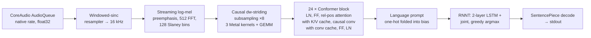

# nemoasr-c

NVIDIA **Nemotron 3.5 ASR Streaming 0.6B** implemented from scratch in C, with the heavy math in hand-written **Metal compute kernels**. No Python, no ML framework: the only dependencies are macOS system frameworks (Metal, Foundation, AudioToolbox, CoreAudio). It reads the same bf16 checkpoint as the MLX version ([`mlx-community/nemotron-3.5-asr-streaming-0.6b`](https://huggingface.co/mlx-community/nemotron-3.5-asr-streaming-0.6b)) and produces token-identical output.

The reference for the architecture was the `nemotron_asr` package in [mlx-audio](https://github.com/Blaizzy/mlx-audio/tree/main/mlx_audio/stt/models/nemotron_asr). Performance against it is in [COMPARISON.md](COMPARISON.md).

## Build and run

```bash
make
./nemoasr-c                         # live microphone, en-US, 560 ms chunks
./nemoasr-c --language auto         # language detection
./nemoasr-c --latency 80            # lowest delay (80 | 320 | 560 | 1120)
./nemoasr-c --file ref/fox.wav      # any sample rate; resampled internally
./nemoasr-c --file ref/narrate.wav --realtime --verbose
./nemoasr-c --list-devices
./nemoasr-c --list-languages
```

The model is found automatically in the Hugging Face cache (downloaded by the Python project); use `--model-dir` for another location. `--dump-mel`, `--dump-enc` and `--dump-tokens` write raw float32 / id files for the parity check below. Ctrl+C stops the microphone and flushes the decoder.

## What is implemented



| Piece | File | Notes |
|---|---|---|
| safetensors reader | `src/safetensors.c` | mmap + header parse; bf16 weights copied into one 64-byte aligned Metal arena |
| JSON | `src/json.c` | small DOM parser for `config.json` and the safetensors header |
| Log-mel frontend | `src/mel.c` | CPU, double-precision radix-2 FFT, exact centered/reflect framing of NeMo |
| Resampler | `src/resample.c` | Blackman-windowed sinc, any ratio, streaming |
| Metal kernels | `src/kernels.metal` | bf16 GEMM (SIMD-group per output column), LayerNorm, relative-position attention, GLU, depthwise conv + LN + SiLU, 3×3 stride-2 convs, LSTM cell, two-stage joint argmax |
| Metal glue | `src/gpu.m` | Objective-C: device, runtime kernel compilation (no fast-math), batched dispatch, shared buffers |
| Encoder | `src/encoder.c` | Mirrors `ConformerStreamingState`: mel cache of 16 frames, per-layer attention (56 frames) and conv (8 frames) caches, exact chunk bookkeeping incl. the final boundary window |
| Decoder | `src/decoder.c` | Greedy RNNT with `max_symbols`, provisional/committed LSTM state, one command buffer per joint step |
| Mic | `src/mic.c` | AudioQueue input at the device's nominal rate, device listing/selection, ring buffer |

Activations are float32; weights stay bf16 in GPU memory and are converted in-register inside the kernels. One encoder chunk is a single Metal command buffer with about 500 dispatches. The decoder issues one small command buffer per joint evaluation because the argmax decides the next step.

## Parity with MLX

```bash
uv run --project ~/fun/nemoasr python tools/mlx_reference.py ref/fox.wav ref/fox --latency 560 --language en-US
./nemoasr-c --file ref/fox.wav --latency 560 --dump-mel out/fox/mel.f32 --dump-enc out/fox/enc.f32 --dump-tokens out/fox/tokens.txt
uv run --project ~/fun/nemoasr python tools/compare.py ref/fox out/fox
```

The comparison covers the log-mel frames, every post-prompt encoder frame and the emitted token ids. On all four test clips, at 80, 560 and 1120 ms, in `en-US` and `auto`, the token sequences are identical to MLX and encoder outputs agree to about 3e-5 absolute.

## Layout

- `src/` C and Metal sources, `Makefile` builds `nemoasr-c` into the project root.
- `tools/mlx_reference.py`, `tools/compare.py` parity tooling (run with the `~/fun/nemoasr` venv).
- `bench/mlx_bench.py`, `bench/run_bench.py` benchmark harness; writes `bench/results.json` and `COMPARISON.md`.
- `ref/` test clips (16 kHz plus 44.1/48 kHz variants) and MLX reference dumps.

## Notes from testing

- **Microphone capture.** The Mac's microphones run at 48 kHz natively. The Python version (PortAudio) switches the device to 16 kHz itself; a first version of this runtime asked CoreAudio's AudioQueue for 16 kHz and got its default-quality converter in the path, which degraded recognition compared with Python although the model output is identical for identical audio. The runtime now records at the device's own rate and resamples with a windowed sinc in `src/resample.c`. `--list-devices` shows each device's native rate.
- **Memory.** Steady state is about 1.3 GB (the bf16 weights in GPU memory plus small buffers). Peak during load is about 2.6 GB because the safetensors file is memory-mapped while it is copied into the GPU arena; the mapping is dropped once loading finishes.
- **Rebuilding.** Object files depend on headers through `-MMD`; after changing a struct in `src/*.h` a plain `make` rebuilds everything that includes it.
